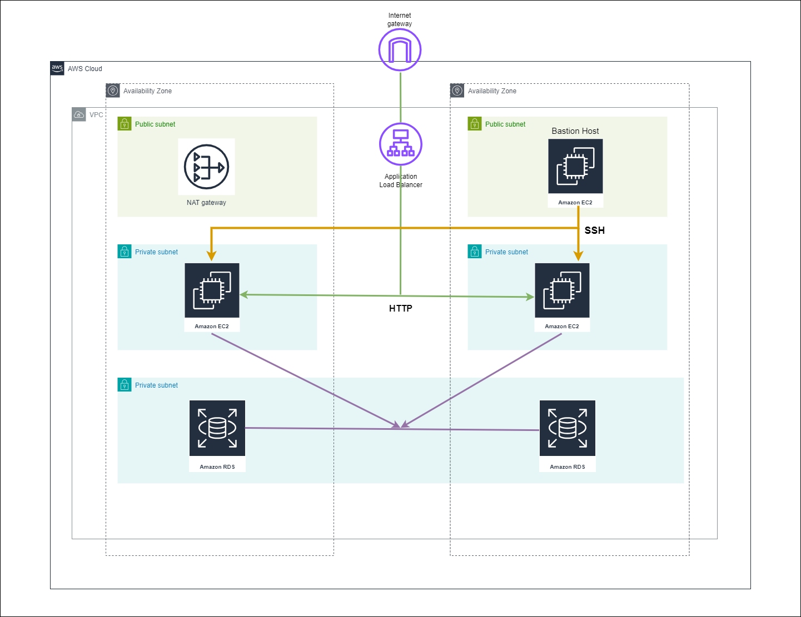

# AWS 3TA

## Introduction
### Terraform Modules we will use
- [terraform-aws-modules/vpc/aws](https://registry.terraform.io/modules/terraform-aws-modules/vpc/aws/latest)
- [terraform-aws-modules/security-group/aws](https://registry.terraform.io/modules/terraform-aws-modules/security-group/aws/latest)
- [terraform-aws-modules/ec2-instance/aws](https://registry.terraform.io/modules/terraform-aws-modules/ec2-instance/aws/latest)
- [erraform-aws-modules/rds/aws](https://registry.terraform.io/modules/terraform-aws-modules/rds/aws/latest)

### Terraform Concepts we will use
- [aws_eip](https://registry.terraform.io/providers/hashicorp/aws/latest/docs/resources/eip)
- [null_resource](https://registry.terraform.io/providers/hashicorp/null/latest/docs/resources/resource)
- [file provisioner](https://www.terraform.io/docs/language/resources/provisioners/file.html)
- [remote-exec provisioner](https://www.terraform.io/docs/language/resources/provisioners/remote-exec.html)
- [local-exec provisioner](https://www.terraform.io/docs/language/resources/provisioners/local-exec.html)
- [depends_on Meta-Argument](https://www.terraform.io/docs/language/meta-arguments/depends_on.html)
- [auto.tfvars, .tfvars file](https://registry.terraform.io/providers/terraform-redhat/rhcs/latest/docs/guides/terraform-vars)
- [datasource tf file](https://registry.terraform.io/providers/hashicorp/local/latest/docs/data-sources/file)

### What was implemented? 
- VPC with 3-Tier Architecture (Web, App and DB)
- AWS Security Group Terraform Module, HTTP port 80, 22 inbound rule for entire internet access `0.0.0.0/0`
- Multiple EC2 Instances in VPC Private Subnets 
- EC2 Instance in VPC Public Subnet `Bastion Host`
- Elastic IP for `Bastion Host` EC2 Instance
- Subnet-group for RDS database
- RDS database in database subnet-group
- Application Load Balancer 
- Single NAT Gateway

